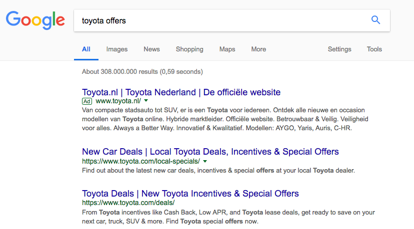
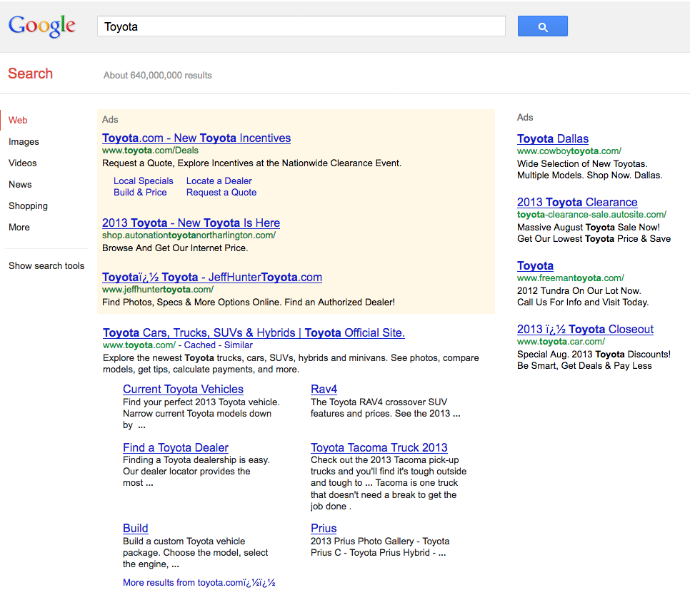
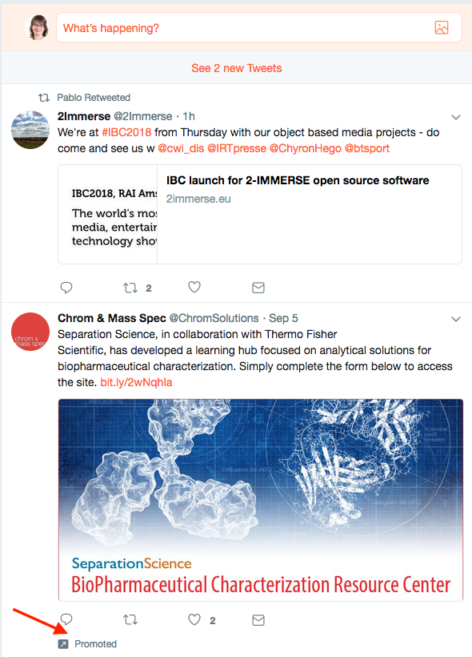
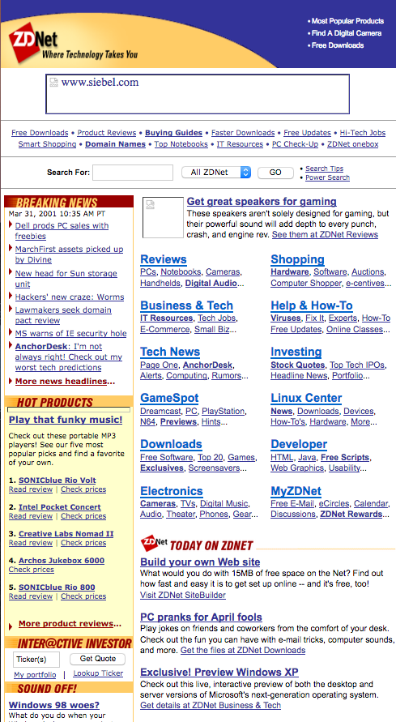
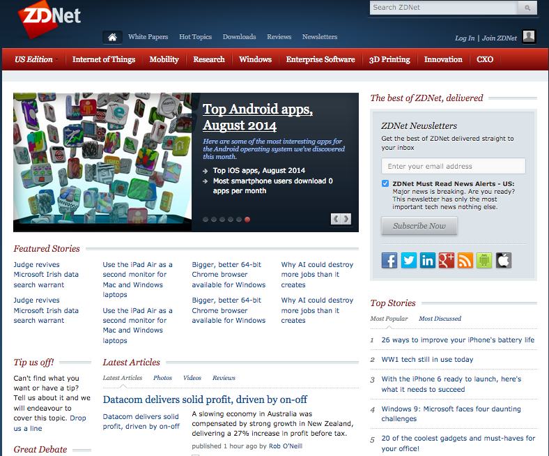
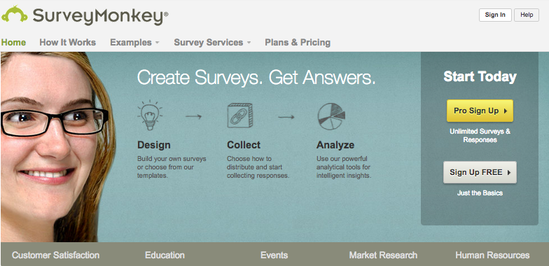
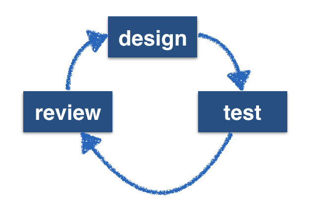
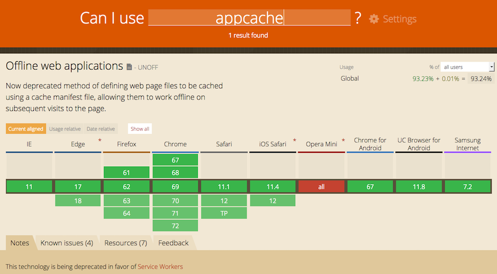

# HTML: the language of the Web

## Learning goals

- Apply Web design principles during the design stage of a Web app.
- Explain the ideas behind usability testing and employ it.
- Employ HTML to create Web pages.

## Web sites vs. Web applications vs. the Web as a platform

The W3C has many working groups, among them (until 2016) the *Web Applications (WebApps) Working Group* whose [goal](https://www.w3.org/2014/06/webapps-charter.html) was as follows:

```
As Web browsers and the Web engine components that power them become ubiquitous across a range 
of operating systems and devices, developers are increasingly using Web technologies to build 
applications and are relying on Web engines as application runtime environments. Examples of 
applications now commonly built using Web technologies include reservation systems, online 
shopping / auction sites, games, multimedia applications, maps, enterprise-specific applications, 
interactive design applications, and PIM (email, calendar, etc) systems. 
```

In 2017 this group was superseded by the [*Web Platform Working Group*](https://www.w3.org/2017/08/webplatform-charter.html) which has a similar goal (but not written up as nicely). The working group is responsible for a number of Web technologies that move us closer towards the vision of the *browser as the operating system*, including:
- client-side database and offline applications;
- file and filesystem APIs;
- WebSockets;
- Web Workers (enables Web applications to spawn background processes);
- DOM & HTML;
- Canvas (for drawing);
- Web Components (a component model for the Web). 

## Electron

Do Web technologies also help you to create desktop apps? Indeed, they do! [Electron](https://electronjs.org/) is an open-source project that enables you to build **cross-platform** desktop apps (for Windows, Mac and Linux) with HTML, JavaScript and CSS - the very technologies you learn about in this course. 

Electron itself uses [node.js](https://nodejs.org/en/), the server-side JavaScript runtime we cover in a later lecture together with [Chromium](https://www.chromium.org/), an open-source Web runtime (i.e. browser).

The major benefit of Electron should be clear: instead of writing three separate desktop variants (one for each operating system) you only have to write and maintain one. New features are integrated in one application instead of three, which reduces feature delivery time. For these reasons, many well-known applications today are built on Electron, including [Visual Studio Code](https://code.visualstudio.com/) (the IDE we recommend you use), the Slack app, [Atom](https://atom.io/) and [many, many more](https://electronjs.org/apps). On the downside, such a cross-platform approach usually brings with it considerable overhead - each application for instance bundles Chromium, which means that even if your app is not doing anything else besides `Hello World` it will be at least 30MB large.

## Web design basics

Web design is not trivial. However, a few basic rules go a long way. Most of these principles may seem obvious, but are often ignored. This lecture is based on the book [Don't Make Me Think, Revisited](http://www.sensible.com/dmmt.html) by Steve Krug. It is very much wworth a read. In the following subsections we go over a number of Krug's rules.

### Rule: Don't make me think

The way a Web site/application (I tend to use the terms interchangeably in this lecture; the rules apply to both apps and sites) works should be self-evident; the user should not have to expend **cognitive effort** to understand what she can do next.

Consider this example of [ebay.com](https://www.ebay.com/) (September 10, 2018):


Here, it is very clear for the user what she can do: search for products, browse through the available items via product categories and get dressed for the upcoming fall season.

Contrast ebay with the following older example from [koopplein](https://web.archive.org/web/20140207233217/http://koopplein.nl/) (February 8, 2014):


Here, it is not self-evident for the user how to act to achieve her goals and a few major questions are raised:

- How do I get to the offers?
- What if I want to look at offers from Delft **and** Rijswijk instead of one or the other?
- What is all this text about?

In case you wonder how it is possible to go back in time and look at older versions of a web site (as today's [koopplein.nl presence](https://koopplein.nl/) looks considerably better), head over to the [Wayback Machine](https://web.archive.org/), maintained by the Internet Archive whose mission it is to **archive** the Web. The Wayback Machine of course does not archive the entire Web (this would be impossible), but it does take regular snapshots of more than **330 billion web pages**, including those of koopplein - [take a look](https://web.archive.org/web/*/koopplein.nl).

When naming and formatting links, buttons, section headers, etc. adhere to **established standards** and **be clear instead of clever**. For instance, a company's web site that has a link to its current job offers should use as link text `Jobs` or `Vacancies` (clear to the user what this link is about) instead of `Interested?` or `Join us!` (less clear).

Similarly, there are established style standards of how to format a link (in the early years of the Web blue underlined text was synonymous with a link and thus we are now stuck with the saying "10 blue links" as a synonym for Web search results). 

Users should **not get lost within a web site**; provide users with information on where they are on how they arrived at that point. Leave so-called **breadcrumbs** as ebay does:


Lastly, it should be easy for the user to **distinguish different parts of a site** - e.g. advertisement vs. content. Here is an example from Google that does a poor job in this respect: it is not obvious on first sight that the first search result is indeed a sponsored search result (i.e. a paid advertisement) instead of a so-called "organic" search result:



A few years ago ([August 15, 2013](https://web.archive.org/web/20130815204510/https://www.google.com/search?q=toyota) to be precise) Google was a lot more forthcoming when it came to notifying its users about advertisements:



It should be mentioned though that Google is not the only offender here, take this example from Twitter which is similarly poorly designed in terms of content distinction between organic tweets and promoted (i.e. paid) ones:



### Rule: Minimize noise and clutter

The rule does not have to be explained, here are two examples that should make things clear:

ZDNet crawled on [March 31, 2001](https://web.archive.org/web/20010331202808/http://www4.zdnet.com:80/)



vs. ZDNet on [August 31, 2014](https://web.archive.org/web/20140831235129/http://www.zdnet.com/)



While it is not hard to go back to very old Web designs and find faults in them, it should also be pointed out that in those times, every single HTTP request/response pair was time-consuming and expensive. It made sense to push as much content as possible into a single Web page which could then be sent to the client in a single HTTP response. 

### Rule: If you cannot make it self-evident, make it self-explanatory

Self-explanatory sites require users to expend a small amount of cognitive effort. When a site is not self-explanatory, a small amount of explanatory text can go a long way. In today's mobile world, it is wise to keep the mobile user in mind as well (a lot of scrolling is undesired). 

Avoid *happy talk* - text without any content for the sake of adding some text (e.g. a welcome message).

A very good example of this rule is the following Surveymonkey [December 1, 2013](https://web.archive.org/web/20131201000510/https://www.surveymonkey.com/)) entry page:



### Expectations vs. reality: usability testing

Our expectations of Web users are often not grounded in reality. We may expect users to be **rational**, **attentive**, with a **clear goal** in mind.

Instead, the average user:

- quickly scans a Web page (not even reading it);
- decides within seconds whether or not a site is worth their attention;
- clicks on the first link they find;
- depends a lot on the browser's back button (and not all Web applications cannot deal with it);
- does not read instructions.

Relevant scientific papers: [1](https://dl.acm.org/citation.cfm?id=1835513), [2](https://dl.acm.org/citation.cfm?id=2835833)

A web application should be designed based on **user reality**. **Usability testing** is an important step to make a Web application successful. Designing-testing-reviewing should be the development cycle:



In a **usability test**, a user is given a **typical task**, e.g.
- How to create a user account;
- How to retrievea a lost password;
- How to change the credit card information;
- How to delete a user account;
- How to find an article in the archive;
- How to edit a posting made in a forum;
- How to start a game;

and her performance on the task is being recorded. Performance metrics depend on the task, it could be the **number of clicks** required to complete the task, the **time taken** or the **number of wrongly clicked elements**. 

Testers should be a mix of target audience and average Web users; 2-3 testers per iteration tend to be sufficient.

A typical usability setup looks as follows:

- **Participant** (tester): sits in front of the laptop/smartphone/...;
- **Facilitator** sits next to her and guides her through the test;
- **Observers** (developers, managers, etc.) watch the usability test.

This [blog post](https://asinthecity.com/2013/04/09/recording-mobile-device-usability-testing-sessions-guerrilla-style/) provides a good and practical overview of usability testing with mobile devices; for a quick look, consider this [participant and facilitator](https://benmelbourne.files.wordpress.com/2013/04/pop-up-mobile-usability-testing-lab-2.jpg) and this [observer](https://benmelbourne.files.wordpress.com/2013/04/pop-up-mobile-usability-testing-lab-5.jpg) setup.

The result of a usability test will be a set of issues. Each of those issues should be assigned a **priority** (low, medium, high) and the next iteration of the development should focus on the high priority problems. No new issues should be added to the list until the most severe issues are fixed.

### Site navigation: the "trunk test"

In order to determine whether a web site's navigation scheme is useful, Krug developed the "trunk test". Given a web site, pick a random page in it, print it and give it to a user who has never seen the site.

As quickly as possible, the user should find:
- the name of the web site;
- the name of the page she currently views;
- major sections of the page;
- possible navigation options at this point;
- *You are here* indicators.

### Entry page checklist

The home page (or entry page) of a web application should answer a number of essential questions:

- What **is** this?
- What can I **do** here?
- Why **should** I be here?
- Whjat do they **have** here?

Surprisingly many home pages are not able to answer these questions. Take for example the home page of [coffeecompany.nl](https://web.archive.org/web/20180810044705/http://coffeecompany.nl/) - it is not obvious that the core business here is a chain of small cafes. Another serial offender are university home pages as immortalized in [this xkcd comic](http://xkcd.com/773/).

## HTML5

### !Activity!
If you have completed the required readings, you should be able to fill in the `???` entries in the HTML `<form>` snippet below which takes a user's search query as input and sends it off to Google. The rendered form looks as follows:


```html
<!doctype html>
<html>
    <head>
        <title>My First Search Form</title>
    </head>
    <body>
        <form action="http://www.google.com/search" method="???" target="_blank">
            <input name="q" type="???" />
            <input type="submit" value="???"/>
        </form>
    </body>
</html>
```

### Overview

HTML5 is a set of related technologies (core HTML5, CSS, JavaScript) that together enable **rich Web content**: 
- **Core HTML5**: mark up content;
- **CSS**: control the appearance of marked-up content;
- client-side **JavaScript**: manipulate the contents of HTML documents and respont do user interactions.

Modern Web application development requires knowledge of all three technologies. *In practice, it also requires a whole set of additional frameworks and technologies to go from prototype code to production code, such as build tools, transpilers, code coverage tools and so on. Even "just" for [frontend coding](https://medium.com/the-node-js-collection/modern-javascript-explained-for-dinosaurs-f695e9747b70). We will introduce a few of those things throughout this course.*

Before HTML5 we had **XHTML** and HTML 4.01. XHTML is a reformulation of HTML 4 as an XML 1.0 application and stands for **Extensible HyperText Markup Language**. It looks as follows (straight from the [W3C XHTML recommendation](https://www.w3.org/TR/xhtml1/)):

```html
<?xml version="1.0" encoding="UTF-8"?>
<!DOCTYPE html 
     PUBLIC "-//W3C//DTD XHTML 1.0 Strict//EN"
    "http://www.w3.org/TR/xhtml1/DTD/xhtml1-strict.dtd">
<html xmlns="http://www.w3.org/1999/xhtml" xml:lang="en" lang="en">
  <head>
    <title>Virtual Library</title>
  </head>
  <body>
    <p>Moved to <a href="http://example.org/">example.org</a>.</p>
  </body>
</html>
```

XHTML was designed to make processing of Web pages **easier for machines** by having a very strict set of rules. The problem though was that (X)HTML is written by developers, not machines and it turned out to be too much hassle to write valid XHTML. Moreover, browsers were and are able to render invalid XHTML pages properly (so why even try to write valid XHTML?) and thus XHTML was eventually abandoned in favour of HTML5, which is not only less strict but also added a host of new features to the language.

With the host of new features **browser compatibility** issues returned: some browser vendors are faster than others in implementing W3C standards (in addition to their own non-standardized features). A good resource to check which browser versions support which HTML5 feature (and to what extent) is [caniuse.com](http://caniuse.com/). We 

### The move towards HTML5

The initial list of HTML tags (1991/92) was **static**: `<title> <a> <isindex> <plaintext> <listing> <p> <h1> <address> <hp1> <dl> <dt> <ul>`. JavaScript was created within 10 days (*which explains many of the JavaScript quirks*) in May 1995 by [Brendan Eich](https://twitter.com/BrendanEich) (a co-founder of Mozilla who is also behind the browser [brave](https://brave.com/), developed to block out ads and trackers) at the time at Netscape; this was the beginning of client-side **dynamic** scripting for the browser. 

**Plugins** (the most famous being Adobe Flash in 1996) were created to go beyond what at the time was possible with HTML. HTML5 was a drive to return rich content **directly** into the browser, without the need for plugins or addons. 

HTML5 introduced a number of **semantic HTML elements** including `<article> <footer> <header> <main> <aside> <section> <output>`. Semantic elements provide **meaning** but do not force a particular presentation. Older HTML elements (pre-HTML5) often do force a particular presentaiton, e.g. `<b>` or `<i>`. At the same time, those heavily used HTML elements cannot be moved to an obsolete state - as this would inevitably break a large portion of the Web. For the browser vendors, backwards compatibility is a necessity, not an option. It should be pointed out that **Semantic HTML** is quite different from the vision of the [Semantic Web](https://www.w3.org/standards/semanticweb/).

As a guideline, when creating an HTML document, it is always best to select the **most specific** element to represent your content (instead of only using `<div>`'s).


### Who decides the HTML standard?

HTML is widely used, which makes standardisation a slow process. Many different stakeholders are part of W3C's [Web Platform Working Group](https://www.w3.org/WebPlatform/WG/) (including Microsoft, Google, Mozilla, Nokia, Baidu, etc.). The standardisation process of the W3C is elaborate, as a wide variety of stakeholders have to build consensus. Confusingly, a **W3C recommendation** is the highest level of standardisation possible, before achieving it, a number of steps leading up to the recommendation are required (taken from the [W3C Recommendation Track Process](https://www.w3.org/2018/Process-20180201/#maturity-levels) document):

1. **Working Draft**: *a document that W3C has published for review by the community, including W3C Members, the public, and other technical organizations.*
2. **Candidate Recommendation**: *a document that W3C believes has been widely reviewed and satisfies the Working Group's technical requirements. W3C publishes a Candidate Recommendation to gather implementation experience.*
3. **Proposed Recommendation**: *a mature technical report that, after wide review for technical soundness and implementability, W3C has sent to the W3C Advisory Committee for final endorsement.*
4. **W3C Recommendation**: *a specification or set of guidelines that, after extensive consensus-building, has received the endorsement of W3C Members and the Director. W3C recommends the wide deployment of its Recommendations. Note: W3C Recommendations are similar to the standards published by other organizations.*

Sloppily one could say that the W3C standardizes what the browser vendors have agreed upon and have chosen to implement (or will implement).

Consensus building takes time. HTML5 for instance was a candidate recommendation in Q4-2012 and became a W3C recommendation in Q4-2014. HTML5.1 was a candidate recommendation in Q1-2015 and became a recommendation in Q4-2016.

As of August 2018, [HTML5.3](https://www.w3.org/TR/html53/) has a *Working Draft* status; if you look at the standard text you will find it to be very elaborate and precise, sufficiently so that any browser vendor can take the text and implement the features described in it without ambiguity. Converting the HTML to a single page PDF file leads to a document of more than 1000 pages!

Note, that in rare cases features added to the Web standard can also be removed again, the [AppCache](https://developer.mozilla.org/en-US/docs/Web/HTML/Using_the_application_cache) is a prime examples of this: it was developed as technology to enable offline Web applications in a simple manner, but turned out to have so many [pitfalls](https://alistapart.com/article/application-cache-is-a-douchebag) that it was eventually abandoned in favour of another set of technolgoies ([Service Workers](https://developers.google.com/web/fundamentals/primers/service-workers/)). However, it is still supported by all major browsers today, as shown here ([source](https://caniuse.com/#search=appcache)):



The W3C writes the following about the AppCache: *This feature is in the process of being removed from the Web platform. (**This is a long process that takes many years.**) Using the application cache feature at this time is highly discouraged. Use service workers instead.* 

## Self-check

Here are a few questions you should be able to answer after having followed the lecture and having worked through the required readings:

1. Which of the following statements about HTML `<form>` methods `GET` and `POST` is true?
    - There is no difference, `GET` and `POST` can be used in exactly the same situations.
    - Through `GET` more data can be sent in an HTTP request than through `POST`.
    - Through `GET`, data is sent more securely than through `POST`.
    - Using `GET`, the data to be sent is visible in the URL which is not the case for `POST`.
2. In the context of Web design, what is the purpose of the trunk test?
3. In a usability test, what is the task of the facilitator?
4. What happens if the `target` attribute is not defined in an HTML `<form>`?
    - The response received after submitting the form is displayed in the current frame or browsing context.
    - The HTML form lacks a required attribute and the browser will inform the user with a `405` error when the user tries to submit the form.
    - The response received after submitting the form is displayed in a new browser window.
    - The HTML form lacks a required attribute and the browser will inform the server with a `505` error that an invalid form request was made.
5. What does it mean for the W3C to produce a recommendation document?
