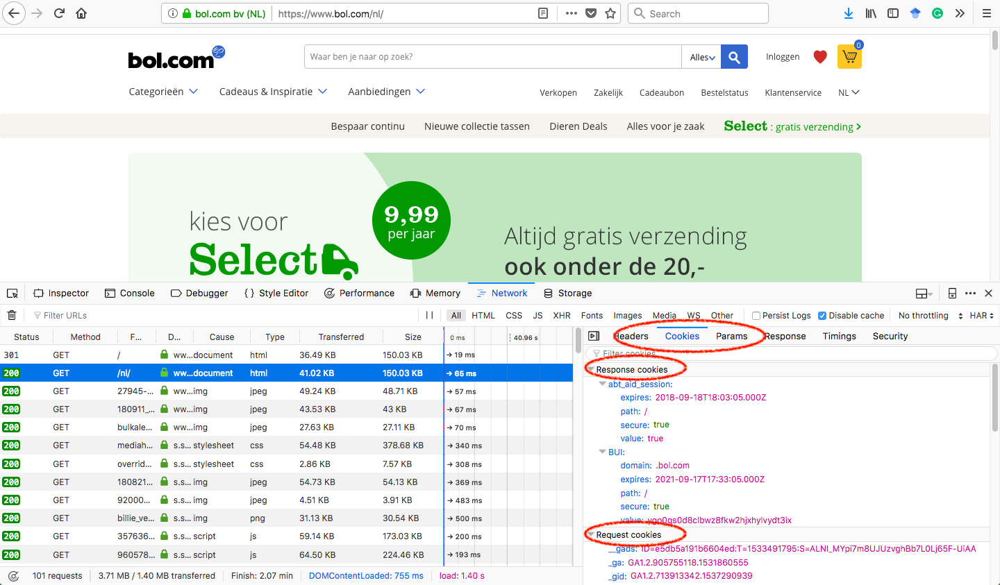
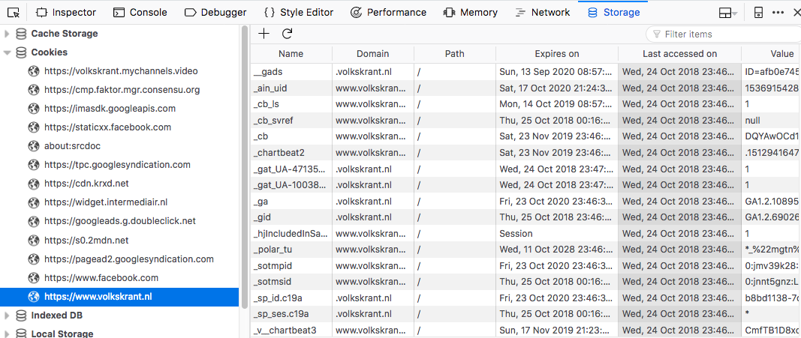
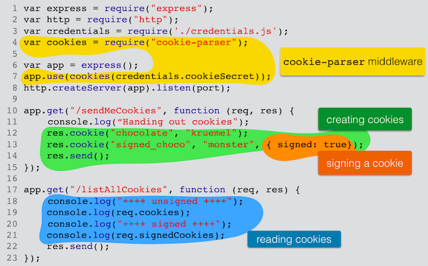
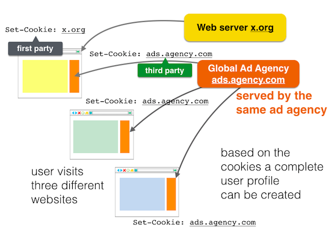
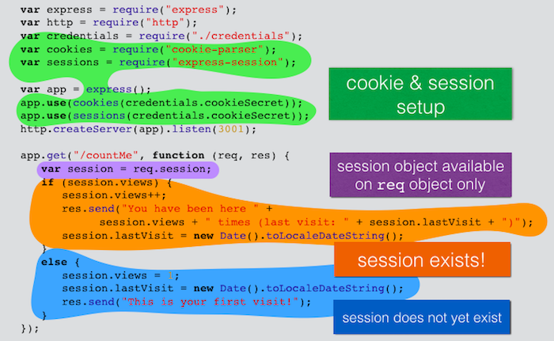
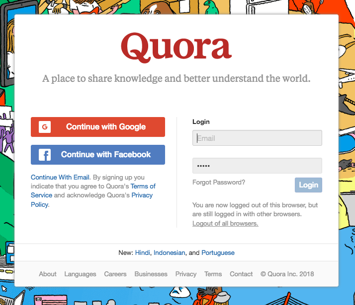
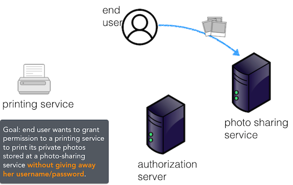
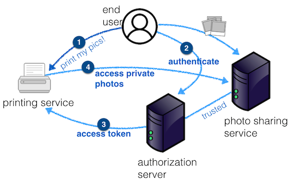
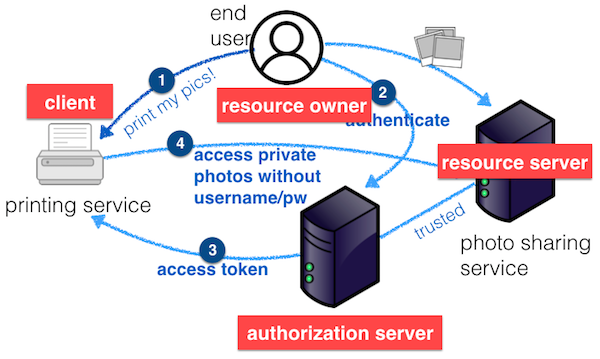

# Cookies, sessions and third-party authentication <!-- omit in toc -->

## Table of Content <!-- omit in toc -->
- [Learning goals](#learning-goals)
- [Recall the HTTP lecture](#recall-the-http-lecture)
- [Introduction to cookies](#introduction-to-cookies)
- [Viewing cookies in the browser](#viewing-cookies-in-the-browser)
- [Cookie security](#cookie-security)
- [Cookies vs. sessions](#cookies-vs-sessions)
- [Cookie flow](#cookie-flow)
- [Cookies in more detail](#cookies-in-more-detail)
    - [Transient vs. persistent cookies](#transient-vs-persistent-cookies)
    - [Cookie fields](#cookie-fields)
    - [Cookie field 'Domain'](#cookie-field-domain)
- [:bangbang: A Node.js application](#bangbang-a-nodejs-application)
- [Accessing and deleting cookies in Express](#accessing-and-deleting-cookies-in-express)
- [A more pessimistic view on cookies](#a-more-pessimistic-view-on-cookies)
    - [Third-party cookies](#third-party-cookies)
    - [Evercookie](#evercookie)
- [Client-side cookies](#client-side-cookies)
- [:bangbang: Sessions](#bangbang-sessions)
- [Third-party authentication](#third-party-authentication)
    - [OAuth 2.0 roles](#oauth-20-roles)
    - [Roles exemplified](#roles-exemplified)
    - [Express](#express)
- [Self-check](#self-check)

## Learning goals

- Decide for a given usage scenario whether cookies or sessions are suitable.
- Explain and implement cookie usage.
- Explain and implement session usage.
- Explain third-party authentication.

## Recall the HTTP lecture

In [Lecture 1](Lecture-1.md) we covered http. Recall, that HTTP is **stateless**, every HTTP request contains all information necessary for the server to send a response in reply to a request. The server is not required to keep track of the requests received. This became obvious when we discussed authentication: the client, making an HTTP request to a server requiring authentication will send the username/password combination in every single request. This design decision simplifies the server architecture considerably.

## Introduction to cookies

The modern web, however, is **not** stateless. Many web applications track users and their state, for example:

- [bol.com](https://www.bol.com/) keeps users' shopping cart filled even when they leave the site;
- [statcounter.com](http://statcounter.com/), a popular user tracking toolkit, can exclude a user from being counted as visitor to a website by setting a specific cookie;
- JavaScript games often keep track of a game's current status and a user can continue playing when re-visiting the game.

**Not the stateless web is the norm, but the stateful web**. Cookies (and sessions) are one way to achieve a stateful web. Cookies are **short amounts of text** that are most often **generated by the server, sent to the client** and **stored by the client** for some amount of time. These small amount of texts consist of a key and a value. **Client-side cookies** (cookies generated by the client and stored by the client) also exist, but as we will see later, they do not contribute to making the web stateful.

A concrete example is a server generating a random user ID and sending it to the client, with `userID` being the key and the randomly generated string being the value.

According to the *HTTP State Management Mechanism* [RFC6265](https://tools.ietf.org/html/rfc6265), clients (most often browsers) should fulfill the following minimum requirements to store cookies:

- store 4096 bytes per cookie;
- store 50 cookies per domain;
- and at least 3000 cookies in total.

Cookies are old compared to other technologies of the web, they have been around since 1994. This also explains their small size - in those days, the Internet was a very slow piece of technology, to transmit 4KB of data, a dial-up modem took about a second. If a web application has 20 cookies to send, all being 4KB large, the user will have waited 20 seconds for just the cookies to be send from server to client.

A server-side application creating cookies should use as few cookies as possible and also make those cookies as small as possible to avoid reaching these implementation limits. In the age of constant video streaming, a few kilobytes worth of cookies seem negligible, however, Internet access is not on the same level in all corners of the world and not every client is a modern browser.

Once you start looking more closely at cookies servers send to clients, you are likely to find cookies with keys like `__utma`, `__utmb` or `__utmz` over and over again. These are [Google Analytics cookies](https://developers.google.com/analytics/devguides/collection/analyticsjs/cookie-usage), one of the most popular toolkits that web developers use to track their web applications' access and usage patterns.

A question we have not yet considered is what actually can be stored in cookies. Cookies are versatile. They act as the **server's short term memory**; the server determines what to store in a cookie, typical examples being:

- the history of a user's page views,
- the setting of HTML form elements (which can also be done fully on the client-side as we will see later), or,
- the user's UI preferences which the server can use to personalize an application's appearance.

## Viewing cookies in the browser

Cookies are **not hidden** from the user, they are stored *in the clear* and can be viewed. Users can also delete and disallow cookies.

Firefox's developer tools are helpful to inspect what is being sent over the network (in this case, cookies):



<sup>Screenshot taken October 10, 2018. Overview of cookies sent/received when accessing https://www.bol.com</sup>

As the name suggests, *Response Cookies* are cookies that are appearing in an HTTP response (cookies sent by the server) and *Request Cookies* are cookies appearing in an HTTP request (cookies sent from client to server). Note, that the client does not send client-generated cookies to the server, the client only *returns* cookies to the server that the server sent to the client beforehand.

When developing web applications, use Firefox's Storage Inspector dev tool tab, which makes debugging cookie settings easy:



<sup>Screenshot taken October 23, 2018. Overview of cookies sent to the client when accessing https://www.volkskrant.nl</sup>

## Cookie security

Cookies are just small pieces of text, in the form of key and value. They can be **altered by the user** and **send back** to the server in their **altered form**.

This opens up a line of attack: a server that is trusting all cookies it receives back from clients without further checks, is susceptible to abuse from malicious users. Imagine a web application that determines the role of a user (e.g., on Brightspace we have instructors, graders, students and visitors) based on some criteria, saves this information in a cookie and sends it to its clients. Each time a client makes a request to a server, the server simply reads out the returned cookie to determine for which role to send back a response. A malicious user can change that role - say, from student to grader - and will receive information that is not intended for her.

In fact, [RFC6265](https://tools.ietf.org/html/rfc6265) contains a stern warning about the use of cookies:

```console
This document defines the HTTP Cookie and Set-Cookie header fields. These header
fields can be used by HTTP servers to store state (called cookies) at HTTP user
agents, letting the servers maintain a stateful session over the mostly stateless
HTTP protocol.
...
Although cookies have many historical infelicities that degrade their security and
privacy the Cookie and Set-Cookie header fields are widely used on the Internet.
```

Overall, security and privacy are not strong points of cookies and as long as we are aware of this and do not try to transmit sensitive or compromising information within cookies, the potential risks are limited. This RFC excerpt also tells us how cookies are sent and received: in the HTTP header fields `Set-Cookie` and in `Cookie` respectively. Let's take a closer look.

## Cookies vs. sessions

Cookies and sessions are closely related. **Sessions make use of cookies**. The difference to the cookie-only setting is the following: a single cookie is generated per client by the server and that cookie only contains a **unique ID**, the rest of the data is **stored on the server** and associated with the client through that id.

**In general, sessions are preferable to cookies as they expose very little information (only a randomly generated id).**

## Cookie flow

In this section, we cover the cookie flow between client and server. Consider the graphic below. On the right we have our server-side application and on the left our browser (the client), which contains a cookie store.


At the first visit to a web application, the client sends an HTTP request not containing a cookie. The server sends an HTTP response to the client including a cookie. Cookies are **encoded in HTTP headers**. At each subsequent HTTP request made to the same server-side application, the browser returns all cookies that were sent from that application. Cookies are actually **bound to a site domain name**, they are only sent back on requests to this specific site - a security feature of the browser. As we will see in a moment, we also have the ability for even more fine-grained control over when to return cookies from client to server.

Servers usually only send a cookie once, unless the key/value pair has changed. While it would be quite tedious to create and manage cookies by hand, modern web frameworks have designated methods to develop web applications that make use of cookies.

## Cookies in more detail

### Transient vs. persistent cookies

Cookies can either be transient or persistent.

**Transient cookies** are also called *session cookies* and only exist in the memory of the client. They are deleted when the browser is closed. They are *not* deleted when just the browser tab or browser window is closed however! **If a cookie has no explicit expiration date, it automatically becomes a session cookie.**

**Persistent cookies** on the other hand remain intact after the browser is closed, they are **stored on disk**. They do have a maximum age and are send back from client to server only as long as they are **valid**, that is they have not yet exceeded their maximum age.

### Cookie fields

Cookies consist of seven components, of which only the first one is a required component:

:one: The `cookie-name=cookie-value` field has to be set for a cookie to be valid;

:two: The `Expires` (expiration date) and `Max-Age` (seconds until the cookie expires) fields whether a cookie is a transient or persistent cookie.

:three: The `Domain` field determines the domain the cookie is associated with and is restricted to the same domain as the server is running on.

:four: The `Path` field determines for which paths the cookie is applicable using wildcarding. Setting the path to a `/` matches all pages, while `/todos` will match all pages under the `/todos` path and so on.

:five: `Secure` flag: if this flag is set for a cookie it will only be sent via HTTPS, ensuring that the cookie is always encrypted when transmitting from client to server. This makes the cookie less likely to be exposed to cookie theft via eavesdropping. This is most useful for cookies that contain sensitive information, such as the session ID. A browser having stored a secure cookie will not add it to the HTTP request to a server if the request is sent via HTTP.

:six: `HttpOnly` flag: cookies with this flag are not accessible to **non-HTTP entities**. By default, cookies can be read out and altered through JavaScript, which can lead to security leaks. Once this flag is set in a cookie it cannot be accessed through JavaScript and thus no malicious JavaScript code snippet can compromise the content of the cookie. Of course, these cookies are still readable to the user that operates the client.

:seven: `Signed` flag: signed cookies allow the server to check whether the cookie value has been tampered with by the client. Let's assume a cookie value `monster`, the signed cookie value is then `s%3Amonster.TdcGYBnkcvJsd0%2FNcE2L%2Bb8M55geOuAQt48mDZ6RpoU`. The server signs the cookie by **appending** a base-64 encoded *Hash Message Authentication Code* (HMAC) to the value. Note that the value is still readable, signed cookies offer **no privacy**, they make cookies though robust against tampering. The server stores a *secret* (a non-guessable string) that is required to compute the HMAC. For a cookie that is returned to the server, the server recomputes the HMAC of the value and only if the computed HMAC value matches the HMAC returned to the server, does the server consider the cookie value as untampered. Unless the server has an easily guessable secret string (such as the default secret string), this ensures no tampering.

### Cookie field 'Domain'

Cookie fields are generally easy to understand. There is only one field which requires a more in-depth explanation and that is the `Domain` field.

Each cookie that is sent from a server to a client has a so-called **origin**, that is the **request domain** of the cookie. For example if a client makes a `GET` request to `http://www.my_site.nl/todos` the request domain of the cookie the server sends in the HTTP response is `www.my_site.nl`. Even if the port or the scheme (http vs https) differ, the received cookie is still applicable. That is, our cookie with the request domain `www.my_site.nl` will also be returned from the client to the server if the next request the client makes is to `https://www.my_site.nl:3005`.

If the `Domain` field is not set, the cookie is only applicable to its request domain. This means that the cookie with request domain `www.my_site.nl` is not applicable if the next request from the client is made to `http://my_site.nl` - note the lack of the `www.` prefix.

If the `Domain` field is set however, the cookie is applicable to the **domain listed in the field and all its sub-domains**. Importantly, the `Domain` field has to cover the request domain as well. This is best explained in an example: let's assume, a client makes for the first time an HTTP `GET` request to `http://www.my_site.nl/todos`. The server sends a cookie in the HTTP header that has a `name=value` field, with the `Path` set to `/` (i.e. the wildcard), and importantly the `Domain` set to `my_site.nl`. The domain attribute covers the more specific request domain. This cookie will be send back to the server by the client when the client any of its sub-domains including `www.my_site.nl`, `todos.my_site.nl` or even something like `serverA.admin.todos.my_site.nl`. The only restriction here is that the domain attribute cannot be a public suffix, like `.com` since that would violate the principle of cookies can ultimately only be returned to the same domain.

Once more:

```console
GET http://www.my_site.nl/todos
Set-Cookie: name=value; Path=/; Domain=my_site.nl
```

is applicable to

```console
www.my_site.nl
todos.my_site.nl
serverA.admin.todos.my_site.nl
```

## :bangbang: A Node.js application

How can we make use of cookies in our server-side application? Do Node.js and Express support the usage of cookies? Yes they do! In fact, dedicated **middleware** makes the usage of cookies with Express easy.

The example application [demo-code/node-cookies-ex](demo-code/node-cookies-ex) shows off a minimal cookie example. Install, run and explore its codebase before continuing. Once the server is started, try out the following URLs:

- http://localhost:3000/sendMeCookies (sends cookies to a client that requests them)
- http://localhost:3000/listAllCookies (lists all cookies sent by the client to the server)

and explore the the cookies sent and received with the browser's dev tools.

Since cookies can be modified by a malicious user we need to be able to verify that the returned cookie was created by our application server. That is what the `Signed` flag is for. To make cookies secure, a **cookie secret** is necessary. The cookie secret is a string that is known to the server and used to compute a hash before they are sent to the client. The secret is ideally a random string.

It is a common practice to externalize third-party credentials, such as the cookie secret, database passwords, and API tokens. Not only does this ease maintenance (by making it easy to locate and update credentials), it also allows you to omit the credentials file from your version control system. This is especially critical for open source repositories hosted on platforms such as GitHub. In [demo-code/node-cookies-ex](demo-code/node-cookies-ex), the credentials are stored in `credentials.js` (which for demo purposes is actually under version control): it is a module that exports an object, which contains the `cookieSecret` property, but could also contain database logins and passwords, third-party authentication tokens and so on :point_down::

```javascript
module.exports = {
    cookieSecret: "my_secret_abc_123"
};
```

Let's look at the annotated code of `app.js` :point_down::



:point_up: The route `/sendMeCookies` sends cookies from the server to the client, one of which is signed. Signing is as simple as setting the `signed` property to `true`. Cookies the client sends back to the server appear in the HTTP request object and can be accessed through `req.cookies`. Here, a distinction is made between signed and unsigned cookies - you can only be sure that the signed cookies have not been tampered with.

## Accessing and deleting cookies in Express

Besides creating cookies, we also need to be able to access and delete them. Both are simple operations. To access a cookie value, append the cookie key to `req.cookies` or `req.signedCookies` :point_down::

```javascript
var val = req.signedCookies.signed_choco;
```

In order to delete a cookie we call the function `clearCookie` in the HTTP **response** object :point_down::

```javascript
res.clearCookie('chocolate');
```

If we dig into the Express code, in particular [response.js](https://github.com/expressjs/express/blob/master/lib/response.js), we find `clearCookie` to be defined as follows:

```javascript
res.clearCookie = function clearCookie(name, options) {
  var opts = merge({ expires: new Date(1), path: '/' }, options);

  return this.cookie(name, '', opts);
};
```

:point_up: This means, that, in order to clear a cookie, the server sends the cookie to the client with an expiration date **in the past**. This informs the browser that this cookie has become invalid and the browser deletes the cookie from its cookie storage. In order to delete a cookie successfully, not only the name has match but also the cookie domain and path.

## A more pessimistic view on cookies

### Third-party cookies

While cookies have many beneficial uses, they are also often associated with user tracking. Tracking occurs through the concept of third-party cookies.

We distinguish two types of cookies:

- **first-party** cookies, and,
- **third-party** cookies.

First-party cookies are cookies that belong to the same domain that is shown in the browser's address bar (or that belong to the sub domain of the domain in the address bar).
Third-party cookies are cookies that belong to domains *different* from the one shown in the browser's address bar.

Web portals can feature content from third-party domains (such as banner ads), which opens up the potential for tracking users' browsing history.

Consider this example:



Here, we suppose a user visits `x.org`. The server replies to the HTTP request, using `Set-Cookie` to send a cookie to the client. This is a first-party cookie. `x.org` also contains an advert from `ads.agency.com`, which the browser loads as well. In the corresponding HTTP response, the server `ads.agency.com` also sends a cookie to the client, this time belonging to the advert's domain (`ads.agency.com`). This is a third-party cookie.
This by itself is not a problem. However, the global ad agency is used by many different websites, and thus, when the user visits other websites, those may also contain adverts from `ads.agency.com`. Eventually, all cookies from the domain `ads.agency.com` will be sent back to the advertiser when loading any of their ads or when visiting their website. The ad agency can then use these cookies to build up a browsing history of the user across all the websites that show their ads.

Thus, technologically **third-party cookies are not different from first-party cookies**.

### Evercookie

As seen in [node-cookies-ex](demo-code/node-cookies-ex), cookies are easy to create, use and delete. The last aspects though only holds for *plain cookies*, i.e. little pieces of information that use the standard cookie infrastructure of the HTTP protocol and the browser.

Storing small pieces of information *somewhere* in the browser can actually be accomplished in many different ways if one knows the technologies within the browser well - cookies can be stored in local storage, session storage, IndxedDB and so on. These components are all part of the regular browser software. Covering them is beyond the scope of this lecture, just be aware that all those components can be misused.

[Evercookie](https://github.com/samyk/evercookie) is a JavaScript API that does exactly that. It produces extremely persistent cookies that are not stored in the browser's standard cookie store, but elsewhere. Evercookie uses several types of storage mechanisms that are available in the browser and if a user tries to delete any of the cookies, it will recreate them using each mechanism available. Note: *this is a tool which should **not** be used for any type of web application used in production, it is however a very good educational tool to learn about different components of the browser.*

## Client-side cookies

So far, we have looked at cookies that are created by a server-side application, sent to clients in response to HTTP requests and then returned to the server in subsequent requests.
We thus have an exchange of information between the client and server. Now, we look at  so-called client-side cookies, that are cookies which are created by the client itself and also only used by the client.

To set a client-side cookie, usually JavaScript is employed. A standard use case is a web form, which the user partially filled in but did not submit yet. Often it is advantageous to keep track of the information already filled in and to refill the form with that data when the user revisits the form. In this case, keeping track of the form data can be done with client-side cookies (i.e. cookies that never leave the client).

This code snippet :point_down: shows how client-side cookies can be set through JavaScript:

```javascript
//set TWO(!) cookies
document.cookie = "name1=value1";                                           //LINE 1
document.cookie = "name2=value2; expires=Fri, 24-Jan-2019 12:45:00 GMT";    //LINE 2

//delete a cookie by RESETTING the expiration date
document.cookie = "name2=value2; expires=Fri, 24-Jan-1970 12:45:00 GMT";    //LINE 3
```

:point_up: To set a cookie we assign a name/value to `document.cookie`. `document.cookie` is a string containing a semicolon-separated list of all cookies. Each time we make a call to it, we can only assign a single cookie. Thus, LINE 2 does not replace the existing cookie, instead we have added a second cookie to `document.cookie`. The cookie added in LINE 3 showcases how to set the different cookie fields.
Deleting a cookie requires us to set the expiration date to a **date in the past**; assigning an empty string to `document.cookie` will **not** have any effect.

The fact that cookies are appended one after the other in `document.cookie` also means that we cannot access a cookie by its name. Instead, the string returned by `document.cookie` has to be parsed, by first splitting the cookies into separate strings based on the semicolon and then determining field name and field value by splitting on `=` :point_down::

```javascript
var cookiesArray = document.cookie.split('; ');
var cookies=[];

for(var i=0; i < cookiesArray.length; i++) {
    var cookie = cookiesArray[i].split("=");
    cookies[cookie[0]]=cookie[1];
}
```

## :bangbang: Sessions

Let's now turn to sessions. Sessions make use of cookies. Sessions improve upon cookies in two ways:

- they enable tracking of user information without too much reliance on the unreliable cookie architecture;
- they allow server-side applications to store much larger amounts of data.

However, we still have the problem that without cookies, the server cannot tell HTTP requests from different clients apart. So, sessions are a compromise or hybrid between cookies and server-side saved data.

Let's describe how sessions work on a todo web application example:


:point_up: A client visits a web application for the first time, sending an HTTP `GET` request to retrieve some todos. The server checks the HTTP request and does not find any cookies, so the server randomly generates a session ID and returns it in a cookie to the client. This is the piece of information that will identify the client in future requests to the server. The server uses the session ID to look up information about the client, usually stored in a database. This enables servers to store as much information as necessary, without hitting a limit on the number of cookies or the maximum size of a cookie.

For this process to be robust, the session IDs need to be generated at random. If we simply increment a session counter for each new client that makes a request we will end up with a very insecure application. Malicious users can snoop around by randomly changing the session ID in their cookie. Of course, this can partially be mitigated by using signed cookies, but it is much safer to not let clients guess a valid session ID at all.

To conclude this section, we discuss how to make use of sessions in Node.js/Express. Sessions are easy to set up, through the use of another middleware component: `express-session`. The most common use cause of sessions is authentication, i.e. the task of verifying a user's identity.

Let's look at [node-sessions-ex](demo-code/node-sessions-ex) for a working toy example. Install, run and explore the code before continuing.



:point_up: Here, we store the session information in memory, which of course means that when the server fails, the data will be lost. In most web applications, we would store this information eventually in a database.
To set up the usage of sessions in Express, we need two middleware components: `cookie-parser` and `express-session`. Since sessions use cookies, we also need to ensure that our middleware pipeline is set up in the correct order: the `cookie-parser` should be added to the pipeline before `express-session`, otherwise this piece of code will lead to an error (*try it out for yourself*).

:point_up: We define one route, called `/countMe`, that determines for a client making an HTTP request, how many requests the client has already made. Once the session middleware is enabled, session variables can be accessed on the session object which itself is a property of the request object - `req.session`. This is the first course of action: accessing the client's session object.
If that session object has a property `views`, we know that the client has been here before. We increment the `views` count and send an HTTP response to the client, informing it about how often the client has been here and when the last visit was. Then we set the property `lastVisit` to the current date and are done.
If `session.views` does not exist, we create the `views` and `lastVisit` properties and set them accordingly, returning a *This is your first visit* as content in the HTTP response.
Finally, it is worth noting that all session-related actions are performed on the `request` object.

## Third-party authentication

The final topic of this lecture is third-party authentication. This is a topic easily complex enough to cover a whole lecture, so here we introduce the principles of third-party authentication, but do not dive into great detail of the authentication protocol.

Even if you are not aware of the name, you will have used third-party authentication already. In many web applications that require a login, we are given the choice of either creating a username/password or by signing up through a third party such as Facebook, Google or Twitter. Below is a login screen of [Quora](https://www.quora.com/), with Facebook and Google acting as third-party authenticators:



Third-party authentication has become prevalent across the web, because **authentication**, i.e. the task of verifying a user's identity, is hard to do right.

If an application implements its own authentication scheme, it has to ensure that the information (username, password, email) are stored safely and securely and not accessible to any unwanted party. Users tend to reuse logins and password and even if a web application does not contain sensitive information, if the username/passwords are stolen, users might have used the same username/password combination for important and sensitive web applications such as bank portals, insurance portals, etc.

To avoid these issues, application developers *out-source* authentication to large companies that have the resources and engineering power to guarantee safe and secure storage of credentials. If an application makes use of third-party authentication, it **never has access to any sensitive user credentials**.

There are two drawbacks though:

- we have to **trust** that the web platform providing authentication is truthful;
- some of our users may not want to use their social web logins to authenticate to an application.

The protocol that governs most third-party authentication services today is the **OAuth 2.0 Authorization Framework**, standardized in [RFC6749](https://tools.ietf.org/html/rfc6749). Its purpose is the following:

```console
The OAuth 2.0 authorization framework enables a third-party application
to obtain limited access to an HTTP service, either on behalf of a resource
owner by orchestrating an approval interaction between the resource owner
and the HTTP service, or by allowing the third-party application to obtain
access on its own behalf.
```

### OAuth 2.0 roles

The OAuth 2.0 protocol knows several roles:

| Role                 | Description                                                                                                                      |
|----------------------|-----------------------------------------------------------------------------------------------------------------------------------|
| Resource owner       | Entity that grants access to a protected resource                                                                                 |
| Resource server      | Server hosting the protected resources, capable of  accepting and responding to protected resource requests using access tokens. |
| Client               |  An application making protected resource requests on   behalf of the resource owner and with its authorization.                  |
| Authorization server | Server issuing access tokens to the client after successfully  authenticating the resource owner and obtaining authorization.     |

The **access token** referred to in the resource server role is a string denoting a *specific scope, lifetime and other access attributes*.

### Roles exemplified

Let's consider this specific example: an end-user (resource owner) can grant a printing service (client) access to her protected photos stored at a photo-sharing service (resource server), without sharing her username and password with the printing service :point_down::



:point_down: The user authenticates directly with a server trusted by the photo-sharing service(authorization server), which issues the printing service delegation-specific credentials (access token):



The mapping between the entities and OAuth 2.0 roles is as follows :point_down::



### Express

To incorporate third-party authentication in an Express application, incorporate an authentication middleware component that is OAuth 2.0 compatible. A popular choice of middleware is [passport](https://www.npmjs.com/package/passport), which incorporates a range of authentication protocols across a number of third-party authenticators.

## Self-check

Here are a few questions you should be able to answer after having followed the lecture and having worked through the required readings:

1. The browser B currently has no stored cookies. A user starts up B today and accesses `http://tudelft.nl/`. In the response, the server sends five cookies to B as seen below. B crashes 10 minutes later and the user restarts B. How many of those cookies are accessible to the user with client-side JavaScript (i.e. `document.cookie`) after the restart of B?

    - Set-Cookie: sid=fd332d; Expires=Fri, 01-Aug-2016 21:47:38 GMT; Path=/; Domain=tudelft.nl
    - Set-Cookie: font=courier; Path=/; Domain=tudelft.nl
    - Set-Cookie: fsize=10; Expires=Thu, 01-Jan-2023 00:00:01 GMT; Path=/; Domain=tudelft.nl
    - Set-Cookie: view=mobile; Path=/; Domain=tudelft.nl; secure; HttpOnly
    - Set-Cookie: last_access=-2; Path=/; Domain=tudelft.nl

2. Which of the following statements about signed cookies is correct?

    - A signed cookie enables the server to issue an encrypted value to the client, that cannot be decrypted by the client.
    - A signed cookie enables the server to verify that the issued cookie is returned by the client unchanged, without having to store the original issued cookie on the server.
    - The value of a signed cookie is encrypted with HMAC to avoid man-in-the-middle attacks. The client can decrypt the value with a previously negotiated key.
    - The value of a signed cookie is always created by the client. The signed attribute indicates to the server that the cookie was generated by the client.

3. Which of the following statements about first & third-party cookies are correct (several correct answers possible)?

    - Third-party cookies originate from the same domain as first-party cookies.
    - Third-party cookies and first-party cookies are stored in the same cookie storage within the browser.
    - Besides the secure and signed flag (available to first-party cookies), third-party cookies can in addition set the persistent flag.
    - A single cookie can be a first-party cookie and a third-party cookie – depending on the URL the browser requests.

4. Which of the following statements correctly describe the roles in the OAuth 2.0 authorization framework (several correct answers possible)?

    - The resource owner grants access to a protected resource.
    - The resource server hosts the protected resource and is capable of accepting and responding to protected resource requests using access tokens.
    - The authorization server issues access tokens to the resource owner after successfully authenticating the client and obtaining authorization.
    - The authorization server makes a protected resource request on behalf of the client and with its authorization.

5. What does a signed cookie protect against?

    - Server-side data tampering: it allows the client to recognize if the cookie value has been changed by the server.
    - Client-side tampering: it allows the server to recognize if the cookie value has been changed by the client.
    - Third-party access: the cookie is signed with its origin domain and the browser will only return the cookie to a server from the same domain.
    - Access of the cookie value by a client that does not have a valid SSL certificate.

6. A session-based system authenticates a user to a Web application to provide access to one or more restricted resources. To increase security, an authentication token should .. (multiple correct answers possible)?

    - act as a replacement for a user’s credentials once a session is established
    - use a non-persistent cookie
    - use a persistent cookie
    - be base-64 encoded